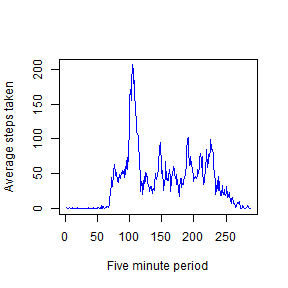
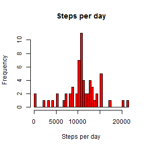
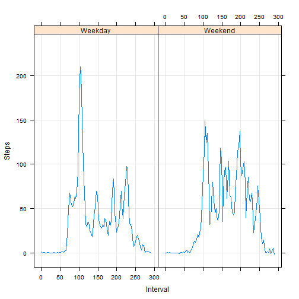

#Reproducible Research: Peer Assessment 1

###John Robinson###

####Loading and preprocessing the data

The data file activity.csv is loaded and the interval column set as a factor in variable activityData


```r
setwd("C:/Users/John/git/RepData1") # Set the working directory
unzip("activity.zip") # Unzip the data
activityData <- read.csv("activity.csv") # Load the data into a variable
activityData$interval <- as.factor(activityData$interval)
```

####What is mean total number of steps taken per day?

The average number of steps per day is shown in the histogram


```r
hist(as.numeric(tapply(activityData$steps,activityData$date,sum)),main="Steps per day", xlab="Steps per day",breaks=61,col="Red")
```

 

```r
summary(tapply(activityData$steps,activityData$date,sum))
```

```
##    Min. 1st Qu.  Median    Mean 3rd Qu.    Max.    NA's 
##      41    8841   10760   10770   13290   21190       8
```

The data show a mean number of steps of 10770 with a median value of 10760  


#### What is the average daily activity pattern?

This is shown in the following plot of the average steps per five minute interval, ignoring any rows with NA values  


```r
meanSteps <- tapply(activityData$steps,activityData$interval,mean,na.rm=TRUE) # Create a variable of the average steps per period
plot(meanSteps,xlab="Five minute period",ylab="Average steps taken",col="blue",type="l") # Time series plot of the means
```

 

The five minute period which contains the maximum number of average steps can be determined by finding the point at which the maximum occurs in the variable meanSteps as follows:


```r
names(meanSteps[meanSteps[]==max(meanSteps)])
```

```
## [1] "835"
```

This shows that the maximum mean activity appears to occur at 8:35 in the morning

#### Imputing missing values

Examination of the original data shows that there are 2304 missing values in the data

In order to address this, the missing values have been replaced by the average number of steps in the equivalent five minute period, taken over all the days of the trial, in a new variable called fullactivityData


```r
fullactivityData <- activityData  # Create variable
for (i in 1:dim(fullactivityData)[1]){  #loop through all elements
     if (is.na(fullactivityData[i,1])) { #if the element is NA replace with the mean previously calculaed in meanSteps
            fullactivityData[i,1] <- as.integer(meanSteps[names(meanSteps)==as.character(fullactivityData[i,3])])
     }   
}
```

The revised average number of steps per day is shown in the histogram


```r
hist(as.numeric(tapply(fullactivityData$steps,fullactivityData$date,sum)),main="Steps per day", xlab="Steps per day",breaks=61,col="Red")
```

 

```r
summary(tapply(fullactivityData$steps,fullactivityData$date,sum))
```

```
##    Min. 1st Qu.  Median    Mean 3rd Qu.    Max. 
##      41    9819   10640   10750   12810   21190
```

The revised data show a mean number of steps of 10750 with a median value of 10640, as compared with the previos average of 10770 and median of 10760.

The addition of the estimates, taken from the calculated mean steps per five minute intervals, has left the average close to its previous value, but shifted the median to the left of the dstribution.


#### Are there differences in activity patterns between weekdays and weekends?

To investigate differneces in activity between week days and weekends, a new column was created of the day names, called days.This column was then parsed to a logical vector, to identify weekend days, and turned into a factor.


```r
fullactivityData <- cbind(fullactivityData,fullactivityData$date) # Create an extra column
names(fullactivityData)[4]="days" # Rename the column
fullactivityData$days <- weekdays(as.Date(fullactivityData$days)) # Create a vector of day names
fullactivityData$days <- fullactivityData$days[] %in% c("Saturday","Sunday") # Parse for weekends
fullactivityData$days <- factor(fullactivityData$days,labels=c("Weekday","Weekend")) # Turn it into a factor
```

The full set of ctivity data is then interrograted to determine the mean number of steps on weekdays and weekends, and plot a smoothed view of the data.


```r
weekendActivity <- fullactivityData[fullactivityData$days=="Weekend",] 
weekdayActivity <- fullactivityData[fullactivityData$days=="Weekday",]
weekendSteps <- tapply(weekendActivity$steps,weekendActivity$interval,mean) # Create a variable of the average steps per period
weekdaySteps <- tapply(weekdayActivity$steps,weekdayActivity$interval,mean)
stepData <- data.frame(c(as.numeric(weekendSteps),as.numeric(weekdaySteps)),c(1:288,1:288),c(rep("Weekend",times=288),rep("Weekday",times=288))) # Create a data frame for plotting results
names(stepData) <- c("Steps","Interval","Days")                      
library("lattice", lib.loc="D:/Programs/R/R-3.1.1/library")
xyplot(Steps~Interval|Days,data=stepData,type=c("spline","g"))
```

 

The differences beetween weekday and weekend activity are clear from the plot. Weekend activity is more evenly spread over the day, with a lower morning peak.
