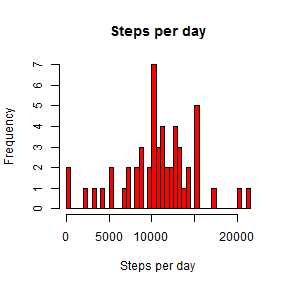

###John Robinson###


####Loading and preprocessing the data

The data file activity.csv is loaded with no further processing


```r
setwd("C:/Users/John/git/RepData1") # Set the working directory
unzip("activity.zip") # Unzip the data
activityData <- read.csv("activity.csv") # Load the data into a variable
```

####What is mean total number of steps taken per day?


```r
hist(as.numeric(tapply(activityData$steps,activityData$date,sum)),main="Steps per day", xlab="Steps per day",breaks=61,col="Red")
```

 

```r
summary(tapply(activityData$steps,activityData$date,sum))
```

```
##    Min. 1st Qu.  Median    Mean 3rd Qu.    Max.    NA's 
##      41    8841   10760   10770   13290   21190       8
```

The data show a mean number of steps of 10770 with a median value of 10760


#### What is the average daily activity pattern?


#### Imputing missing values


#### Are there differences in activity patterns between weekdays and weekends?
